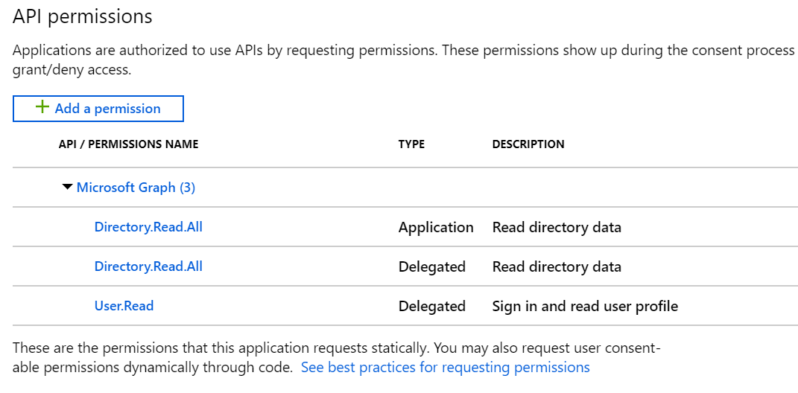
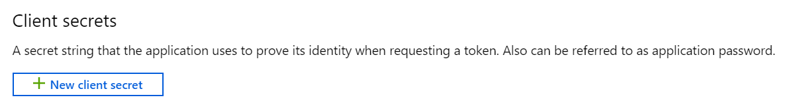

# How to consume Microsoft Graph API using Azure AD authentication in .NET Core


Following [this article](https://itnext.io/a-memo-on-how-to-implement-azure-ad-authentication-using-react-and-net-core-2-0-3fe9bfdf9f36), you are now able to authenticate your users in your application using Azure Active Directory. But you can only retrieve basic informations about a user (id, mail, name). That can be enough for most applications but some business applications may need to use other data inside the Microsoft ecosystem.

Hopefully, there is an API for that and its name is Microsoft Graph, and you can consume it by reusing the `access token` provided by the Azure AD authentication mechanism.

## Configuration

### Azure AD configuration

At the moment, you should already have an Azure AD application. But in order to consume the Graph API, you will have to update the configuration. So, let's go back in the Azure portal and configure our app registration.

First of all, you have to authorize access to the Microsoft Graph through the Azure AD application:



On every application, the `User.Read` permission is required in order to login the current user and retrieve its information. You can also add other permissions based on your application needs.

Then, during the authentication process to MS Graph in the back, we need to provide a `ClientSecret` key.



### Backend configuration

From your Azure AD app, you can now set your configuration file:

```json
"AzureAd": {
    "Instance": "https://login.microsoftonline.com/",
    "Tenant": "my-org.onmicrosoft.com",
    "ClientId": "11111111-aaaa-2222-bbbb-33333333333",
    "ClientSecret": "abcdefghijklmnopqrstuvwxyz0123456789"
}
```

Before accessing the Microsoft Graph, we need to set a Microsoft Graph token. You can the process below.

```cs
public async Task AuthenticateRequestAsync(HttpRequestMessage request)
{
    var httpContext = _httpContextAccessor.HttpContext;

    string token = await httpContext.GetTokenAsync("access_token");

    string assertionType = "urn:ietf:params:oauth:grant-type:jwt-bearer";

    var user = httpContext.User;
    var claim = user.FindFirst(ClaimTypes.Upn) ?? user.FindFirst(ClaimTypes.Email);
    string userName = claim?.Value;

    var userAssertion = new UserAssertion(token, assertionType, userName);

    var authContext = new AuthenticationContext(_authSettings.Authority);
    var clientCredential = new ClientCredential(_authSettings.ClientId, _authSettings.ClientSecret);

    var result = await authContext.AcquireTokenAsync("https://graph.microsoft.com", clientCredential, userAssertion);

    request.Headers.Authorization = new AuthenticationHeaderValue(result.AccessTokenType, result.AccessToken);
}
```

## Making API requests

Now, that you are authenticated with both the Azure AD token and the Microsoft Graph token, you can query this API now.

If you want to see the code in details, please check the following repository: https://github.com/Odonno/azuread-msgraph-dotnet-core

### Get current user

The one thing you can do is to retrieve detailed information about the user currently logged in.

```cs
public async Task<User> GetUserProfileAsync()
{
    var client = new GraphServiceClient(_msGraphAuthenticationProvider);
    return await client.Me.Request().GetAsync();
}
```

### Get a list of users

Also, on interesting feature could be to search users inside your organization. There is not really a search function in the Microsoft Graph API but you can make something close by using the ODATA operators `$top` and `$filter`.

```cs
public async Task<List<User>> SearchUsersAsync(string search, int limit)
{
    var client = new GraphServiceClient(_msGraphAuthenticationProvider);
    var users = new List<User>();

    var currentReferencesPage = await client.Users
        .Request()
        .Top(limit)
        .Filter($"startsWith(displayName, '{search}') or startswith(mail, '{search}')")
        .GetAsync();

    users.AddRange(currentReferencesPage);

    return users;
}
```

## Thank you!

This article is mainly inspired by the one made by Joonas Westlin https://joonasw.net/view/azure-ad-on-behalf-of-aspnet-core